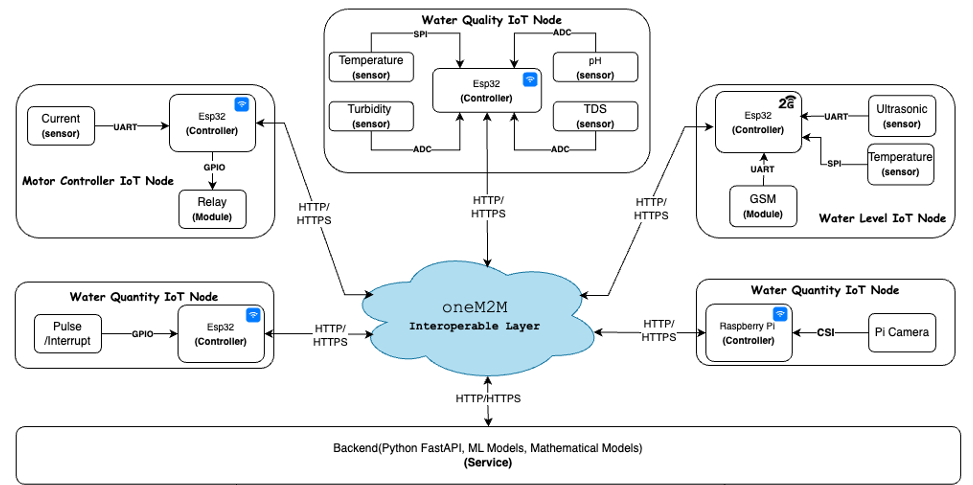
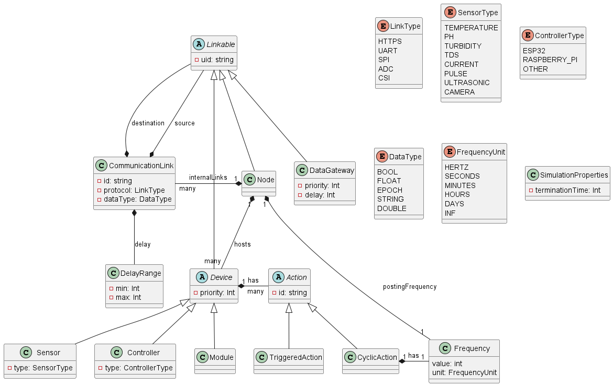

# Smart City DSML

This repository contains the code and an example file for the Smart City domain specific modeling language.

## Example

An example implementation using the DSML can be found [here](example.smartcity).

It aims to represent the upper part of following scenario:
 

## Model

This graphical representation of the underlying metamodel can help to understand the structure of the DSML:

## Performance

The execution time of the code generator scales well for larger input files, as the follwing table shows:

| Scale Factor | Input File Lines of Code | Generation Times (ms) (3 Runs)| Generated LoC | Notes
| ------------- | -------------- | -------------- | ------------ | -------------- |
| Baseline | 75 | 1425, 1468, 1463 | 740 | Initial scenario
| 2× | 145 | 1463, 1532, 1486 | 1330 | Doubled
| 4× | 285 | 1550, 1558, 1550 | 2510 | Quadrupled
| 8× | 565 | 1668, 1659, 1630 | 4870 | Eightfold increase
| 32× | 2245 | 2164, 2186, 2131 | 19030 | Stress Test: 32×

The python script to generate the input files can be found in [evaluation](/evaluation).

## Instructions

1. [Download](https://eclipse.dev/Xtext/) Eclipse with Xtext
2. Check out/download this repository and import the projects in Eclipse
3. Follow these [guidelines](https://blogs.itemis.com/en/get-started-with-xtext-and-eclipse-in-5-minutes) from "Generating the language infrastructure" on, an example model that you can import is available in the repository (example.smartcity)
4. To generate executable [Python PDEVS](https://msdl.uantwerpen.be/documentation/PythonPDEVS/index.html) models ....
